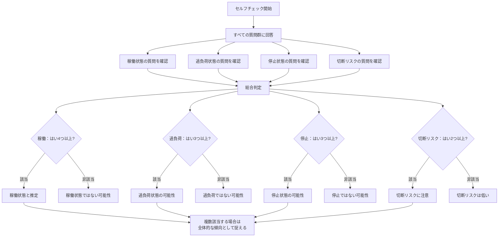
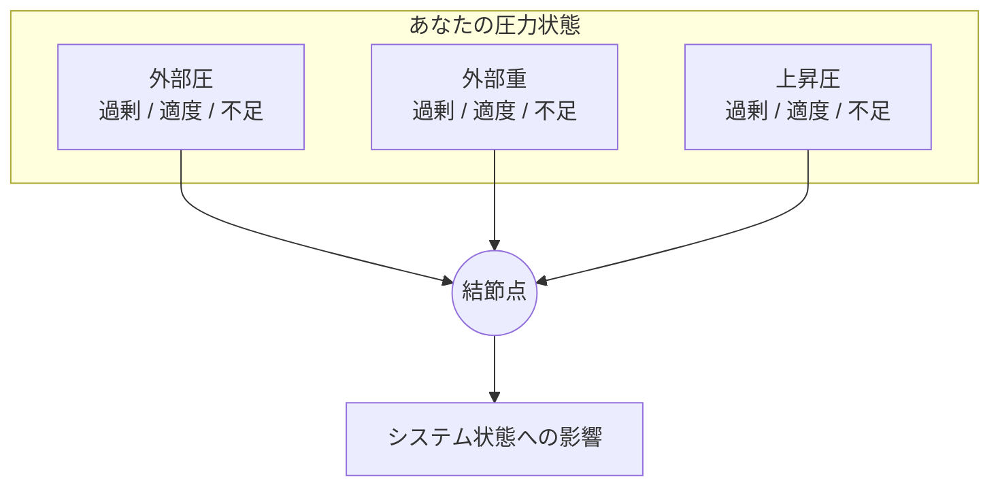

## 付録B　セルフチェックシート

本付録では、ポラリミクスの体系を用いて自己の状態を診断するための質問群を提供する。

これは医学的・心理学的診断ではない。自己理解を深めるための補助ツールとして活用されたい。

---

### B-1　現在の状態診断

以下の質問群すべてに答え、自分のシステムが現在どの状態にあるかを確認する。複数の状態に同時に該当する場合もあり得るため、排他的に捉えず、全体的な傾向として参照されたい。

#### 稼働状態の確認

|No.|質問|はい|どちらとも|いいえ|
|---|---|---|---|---|
|1|好きなものを「好き」と自然に感じられる|□|□|□|
|2|嫌いなものを「嫌い」と自然に感じられる|□|□|□|
|3|感情が適度な速度で変化している|□|□|□|
|4|好き嫌いの判断に過度な労力を要しない|□|□|□|
|5|日常的に何かに惹かれる感覚がある|□|□|□|

**判定**：「はい」が4つ以上 → 稼働状態の可能性が高い

---

#### 過負荷状態の確認

|No.|質問|はい|どちらとも|いいえ|
|---|---|---|---|---|
|1|短時間で好き嫌いが激しく反転する|□|□|□|
|2|好きなのか嫌いなのか分からなくなることがある|□|□|□|
|3|感情的に消耗している感覚がある|□|□|□|
|4|内側に熱がこもっているような感覚がある|□|□|□|
|5|判断を求められると強いストレスを感じる|□|□|□|

**判定**：「はい」が3つ以上 → 過負荷状態の可能性がある

---

#### 停止状態の確認

|No.|質問|はい|どちらとも|いいえ|
|---|---|---|---|---|
|1|何を見ても特に感情が動かない|□|□|□|
|2|以前好きだったものに興味が湧かない|□|□|□|
|3|好き嫌いを聞かれても答えが出てこない|□|□|□|
|4|感情が平坦で起伏がない|□|□|□|
|5|何かを始めるエネルギーが湧かない|□|□|□|

**判定**：「はい」が3つ以上 → 停止状態の可能性がある

---

#### 切断リスクの確認

|No.|質問|はい|どちらとも|いいえ|
|---|---|---|---|---|
|1|好き嫌いという感覚そのものが理解できない|□|□|□|
|2|自分が何者か分からなくなることがある|□|□|□|
|3|感情が自分のものではないように感じる|□|□|□|
|4|世界との繋がりが断たれている感覚がある|□|□|□|
|5|過負荷または停止が長期間続いている|□|□|□|

**判定**：「はい」が2つ以上 → 切断リスクに注意が必要

---

#### 総合判定

すべての質問群に回答した上で、以下のフローチャートを参考に総合的に判定する。複数の状態に該当する場合は、最も多く該当した状態を主傾向としつつ、他の該当状態も補助的に参照されたい。

---

### B-2　三位一体バランス診断

自分のシステムにおいて、どの計測レイヤーが優位に働いているかを確認する。

#### シーソー（一位）優位の確認

|No.|質問|はい|どちらとも|いいえ|
|---|---|---|---|---|
|1|好き嫌いをはっきり決めたい傾向がある|□|□|□|
|2|どちらが優位か白黒つけたくなる|□|□|□|
|3|曖昧な状態が苦手である|□|□|□|
|4|一度決めた好き嫌いは変わりにくい|□|□|□|

**判定**：「はい」が3つ以上 → シーソー優位型

---

#### メトロノーム（二位）優位の確認

|No.|質問|はい|どちらとも|いいえ|
|---|---|---|---|---|
|1|好き嫌いが頻繁に変わる|□|□|□|
|2|気分によって評価が変動しやすい|□|□|□|
|3|同じものでも時期によって好き嫌いが異なる|□|□|□|
|4|感情のリズムや波を強く感じる|□|□|□|

**判定**：「はい」が3つ以上 → メトロノーム優位型

---

#### 回転振り子（三位）優位の確認

|No.|質問|はい|どちらとも|いいえ|
|---|---|---|---|---|
|1|好きと嫌いを同時に感じることがある|□|□|□|
|2|複雑な感情を抱きやすい|□|□|□|
|3|愛憎入り混じる感覚に馴染みがある|□|□|□|
|4|単純な二択では表現できない感情が多い|□|□|□|

**判定**：「はい」が3つ以上 → 回転振り子優位型

---

#### バランス診断結果の見方

|優位型|特徴|留意点|
|---|---|---|
|シーソー優位|判断が明確、安定感がある|柔軟性の欠如、変化への抵抗に注意|
|メトロノーム優位|変化に敏感、適応力がある|不安定さ、一貫性の欠如に注意|
|回転振り子優位|複雑さを許容、深みがある|混乱、判断困難に注意|
|バランス型|三位が均衡している|特定の状況で偏りが出る可能性|

---

### B-3　圧力源の特定

自分のシステムに作用している力を把握する。

#### 外部圧の確認

|No.|質問|強い|中程度|弱い|
|---|---|---|---|---|
|1|周囲からの期待やプレッシャーを感じる|□|□|□|
|2|他者の評価が気になる|□|□|□|
|3|社会的な役割に追われている|□|□|□|
|4|急かされている感覚がある|□|□|□|
|5|他者からの働きかけが多い|□|□|□|

**判定**：「強い」が3つ以上 → 外部圧が過剰な可能性

---

#### 外部重の確認

|No.|質問|強い|中程度|弱い|
|---|---|---|---|---|
|1|責任の重さを感じている|□|□|□|
|2|過去の出来事が心に重くのしかかっている|□|□|□|
|3|解決していない問題を抱えている|□|□|□|
|4|身動きが取れない感覚がある|□|□|□|
|5|何かに押し潰されそうな感覚がある|□|□|□|

**判定**：「強い」が3つ以上 → 外部重が過剰な可能性

---

#### 上昇圧の確認

|No.|質問|強い|中程度|弱い|
|---|---|---|---|---|
|1|生きているという実感がある|□|□|□|
|2|内側から湧き上がるエネルギーを感じる|□|□|□|
|3|何かをしたい、知りたいという衝動がある|□|□|□|
|4|朝起きたとき、一日を始める力がある|□|□|□|
|5|困難があっても立ち上がれると感じる|□|□|□|

**判定**：「弱い」が3つ以上 → 上昇圧が不足している可能性

---

#### 圧力バランスの総合判定

|外部圧|外部重|上昇圧|推測される状態|
|---|---|---|---|
|適度|適度|適度|稼働|
|過剰|適度|適度|過負荷リスク|
|適度|過剰|適度|停滞傾向|
|適度|適度|不足|停止リスク|
|過剰|過剰|適度|高圧状態、過負荷|
|過剰|過剰|不足|切断リスク|
|不足|不足|過剰|噴出傾向（急激な感情表出）|

---

### 使用上の注意

このセルフチェックシートは、自己理解のための参考ツールである。

結果が気になる場合、特に切断リスクが示唆される場合は、信頼できる人への相談や、専門家のサポートを検討されたい。

ポラリミクスが示すように、上昇圧が絶えない限り、常に新しい「立ち上がり」の可能性がある。

---
