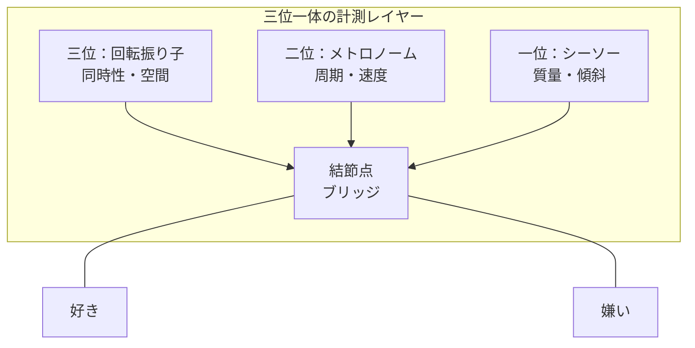
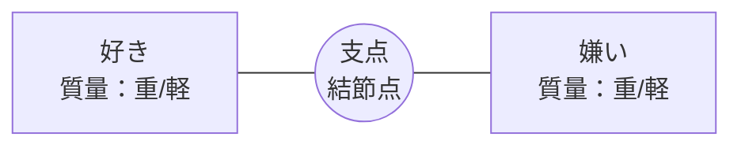
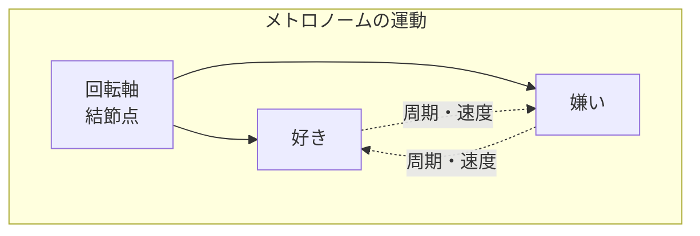
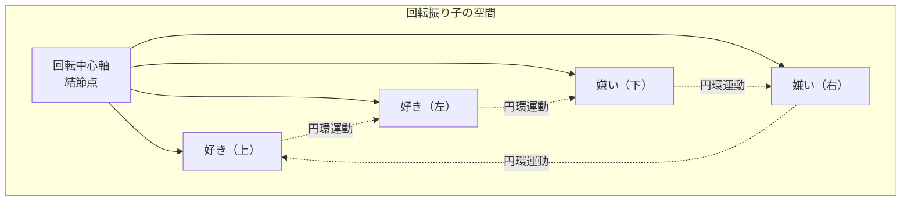

## 第2章　基本構造：三位一体の計測レイヤー

ポラリミクスの基本構造は、「好き」と「嫌い」を両端に配置し、その間に「真ん中のないブリッジ（結節点）」を核とした三層の計測機構である。

この三層を「三位一体の計測レイヤー」と呼ぶ。それぞれのレイヤーは、好き嫌いの異なる側面を計測する。なお、ここで言う「真ん中のないブリッジ」とは、好きと嫌いの中間点として存在するのではなく、虚無でありながら全てを変換する結節点を指す。その詳細は第4章で述べる。

|レイヤー|計測対象|物理的役割|結節点の機能|
|---|---|---|---|
|一位：シーソー|質量・傾斜|どちらが重いか（優位性）の確定|支点（フルクラム）|
|二位：メトロノーム|周期・速度|感情の反転リズムとタイミング|振り子の回転軸|
|三位：回転振り子|同時性・空間|好き嫌いの重畳と円環運動|垂直の回転中心軸|

重要なのは、これら三つのレイヤーが独立して存在するのではなく、ひとつの結節点を共有しているという点である。シーソーの支点、メトロノームの回転軸、回転振り子の中心軸——これらは全て同一の点に収束する。

この結節点こそが、ポラリミクスの核心である。

---

### 2-1　一位：シーソー

シーソーは、最も基本的な計測レイヤーである。

「好き」と「嫌い」を天秤の両端に載せ、どちらが重いかを測る。傾きによって、現時点での優位性が確定する。

シーソーが計測するのは「質量」と「傾斜」である。

質量とは、その感情がどれだけの重みを持っているかを示す。軽い好意と、魂を揺さぶるような深い愛着では、質量が異なる。同様に、軽い不快感と、存在を否定したくなるような嫌悪では、質量が異なる。

傾斜とは、現時点でどちらに傾いているかを示す。完全に水平であることは稀であり、ほとんどの場合、どちらかに傾いている。

結節点は、このシーソーにおいて「支点（フルクラム）」として機能する。支点がなければ、シーソーは傾くことができない。しかし、支点そのものには質量がない。支点は「無」でありながら、傾きを可能にする。

---

### 2-2　二位：メトロノーム

メトロノームは、時間軸を導入した計測レイヤーである。

シーソーが「今、どちらに傾いているか」を測るのに対し、メトロノームは「どのくらいの速さで反転するか」を測る。

好き嫌いは静止しない。昨日好きだったものが今日嫌いになる。あるいは、一瞬で反転することもある。メトロノームは、この反転のリズムとタイミングを計測する。

計測対象は「周期」と「速度」である。

周期とは、好きから嫌いへ、あるいは嫌いから好きへと移行するまでの時間間隔を示す。周期が長ければ感情は安定しており、短ければ不安定である。

速度とは、反転が起こる際の急峻さを示す。ゆっくりと移行することもあれば、瞬時に反転することもある。

結節点は、このメトロノームにおいて「振り子の回転軸」として機能する。振り子は軸を中心に左右に振れる。軸がなければ、振り子は振れない。

---

### 2-3　三位：回転振り子

回転振り子は、最も複雑な計測レイヤーである。

シーソーは一軸上の傾きを、メトロノームは時間軸上の往復を扱う。回転振り子は、これを三次元的な円環運動へと拡張する。

回転振り子が計測するのは「同時性」と「空間」である。

同時性とは、好きと嫌いが同時に存在しうるという事態を指す。私たちは時に、何かを好きであると同時に嫌いでもある。矛盾しているようだが、これは珍しいことではない。愛憎という言葉が示すように、愛と憎しみは共存しうる。

空間とは、好きと嫌いが単なる一直線上の両極ではなく、立体的な空間内で位置を持つことを示す。回転振り子は、この空間内を円環運動する。

結節点は、このレイヤーにおいて「垂直の回転中心軸」として機能する。回転運動の中心には、常に軸がある。しかしその軸自体は回転しない。静止したまま、回転を可能にする。

三位一体の計測レイヤーは、このようにして好き嫌いの多面的な性質を捉える。一位で重さを、二位でリズムを、三位で空間的重畳を計測する。そしてその全てが、ひとつの結節点を共有している。

---
