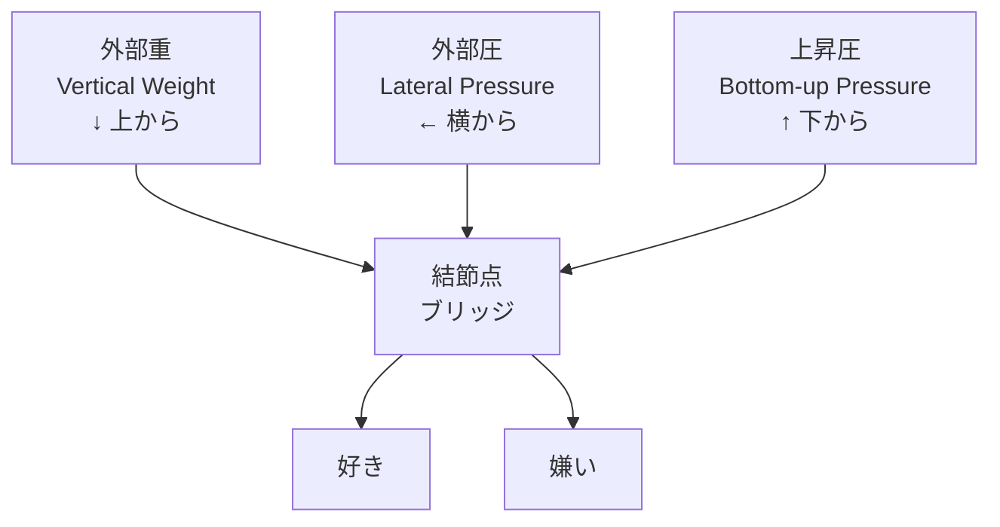
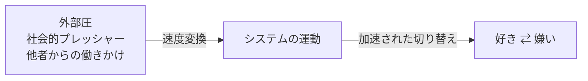
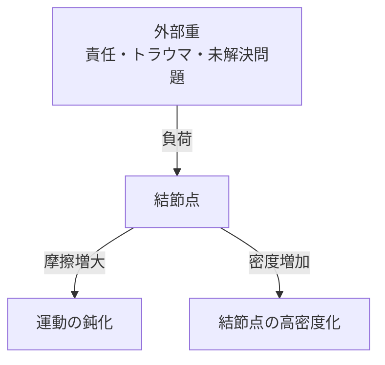
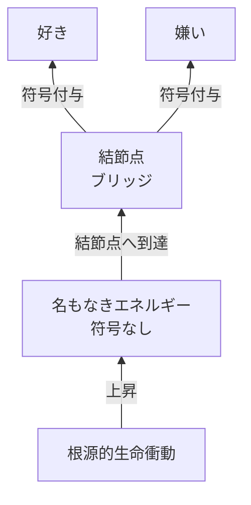
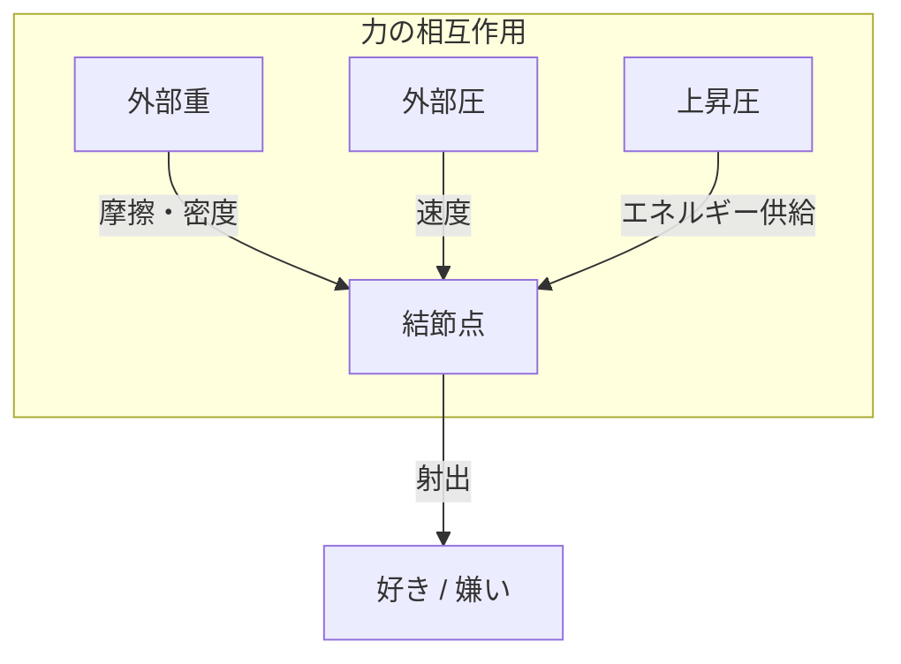

## 第3章　ベクトル力学：システムに作用する力

三位一体の計測レイヤーは、それ自体では動かない。システムを駆動させるのは、外部および内部から作用する「力」である。

ポラリミクスでは、三方向の力がシステムに作用する。

| 力の種類                    | 方向  | 作用           | 変換先       |
| ----------------------- | --- | ------------ | --------- |
| 外部圧（Lateral Pressure）   | 横から | 感情切り替えの運動を加速 | 速度        |
| 外部重（Vertical Weight）    | 上から | システムへの負荷     | 摩擦・密度     |
| 上昇圧（Bottom-up Pressure） | 下から | 根源的な生命衝動     | 立ち上がり（噴出） |

これら三つの力は、それぞれ異なる性質を持ち、異なる効果をシステムにもたらす。

---

### 3-1　外部圧（Lateral Pressure）

外部圧は、横方向からシステムに加わる圧力である。

重要な特性として、外部圧はシステム内部の状態と連動しない。外からどれだけ押されても、それが直接内部の状態——上昇圧によるエネルギーの蓄積や、三位一体のレイヤーの運動そのものが生む力——を変えるわけではない。外部圧は、運動の「速度」へと変換される。

具体的に言えば、外部圧は感情の切り替えを加速させる。

外部圧が強い状況とは、例えば周囲からの期待、社会的なプレッシャー、他者からの働きかけなどである。これらは、好きから嫌いへ、あるいは嫌いから好きへの移行を加速させる。しかし、移行の方向そのものを決定するわけではない。

外部圧は「押す」力であり、「傾ける」力ではない。天秤をどちらに傾けるかは、外部圧だけでは決まらない。符号の方向——「好き」になるか「嫌い」になるか——は、外部圧と外部重の相互作用、および三位一体の計測レイヤーによる計測の総体として決定される。このメカニズムの詳細は、第4章で述べる。

---

### 3-2　外部重（Vertical Weight）

外部重は、上方向からシステムに加わる重みである。

外部圧が横から押すのに対し、外部重は上から圧し掛かる。これはシステムへの「負荷」として機能する。

外部重がもたらすのは「摩擦」と「密度」である。

摩擦とは、システムの運動に対する抵抗である。外部重が大きいほど、システムは動きにくくなる。感情の切り替えが鈍くなり、現状に固着しやすくなる。

密度とは、結節点における凝縮である。外部重が大きいほど、結節点は圧縮され、高密度化する。これは後述する「過負荷」状態につながる。

外部重が大きい状況とは、例えば責任の重さ、トラウマ的な経験の蓄積、解消されない問題の堆積などである。これらは上からシステムを押し潰そうとする。

---

### 3-3　上昇圧（Bottom-up Pressure）

上昇圧は、下方向からシステムに湧き上がる圧力である。

これは外部からの力ではなく、根源的な生命衝動に由来する。上昇圧は、好き嫌いを平面的な判断から、立体的な「立ち上がり（噴出）」へと昇華させる。

上昇圧が運んでくるのは「名もなきエネルギー」である。

このエネルギーは、まだ「好き」でも「嫌い」でもない。符号を持たない、純粋な生命力である。このエネルギーが結節点に到達し、外部圧と外部重の相互作用を受けて初めて、「好き」または「嫌い」という符号が与えられる。

上昇圧は、システムが停止しない限り、常に存在する。生きている限り、下からの湧き上がりは絶えない。

---

### 三つの力の相互作用

これら三つの力は、独立して作用するのではなく、結節点において相互に影響し合う。

上昇圧が名もなきエネルギーを運び上げ、外部圧がそれに速度を与え、外部重が摩擦と密度を調整する。この三つの力のバランスによって、システムの挙動が決まる。

|力の組み合わせ|システムの挙動|
|---|---|
|上昇圧 強 / 外部圧 弱 / 外部重 弱|自然な感情の流れ、安定した射出|
|上昇圧 強 / 外部圧 強 / 外部重 弱|急速な感情変化、激しい振れ幅|
|上昇圧 強 / 外部圧 弱 / 外部重 強|感情の固着、動きにくさ|
|上昇圧 強 / 外部圧 強 / 外部重 強|高圧状態、過負荷リスク|
|上昇圧 弱 / 外部圧 ─ / 外部重 ─|感情の希薄化、停止リスク|

三つの力が結節点で交わり、そこから「好き」と「嫌い」が射出される。この射出のメカニズムについては、次章で詳しく述べる。

---
