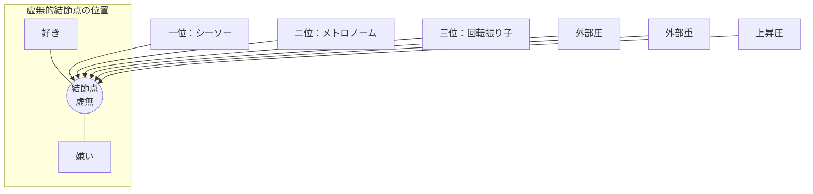
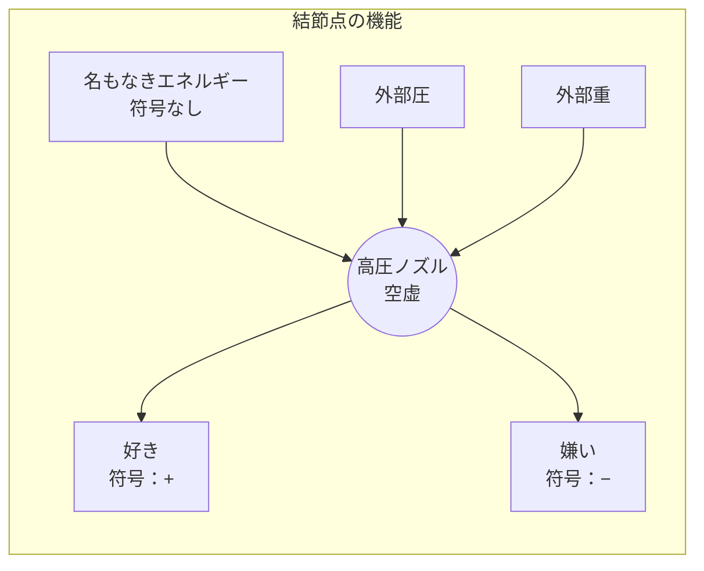
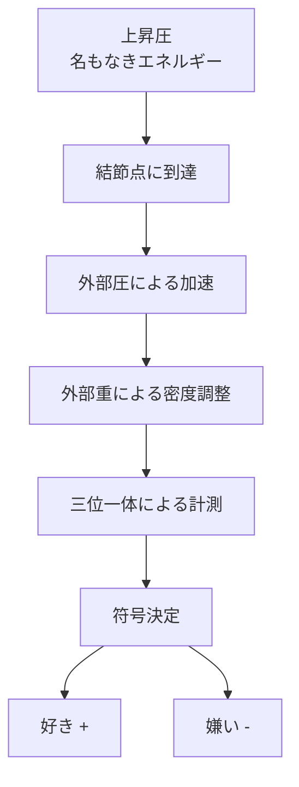

## 第4章　虚無的結節点（ブリッジ）

ここまで、三位一体の計測レイヤーと三方向の力について述べてきた。そのすべてが収束する点——それが「結節点（ブリッジ）」である。

ポラリミクスにおいて、結節点は最も重要な概念である。そして最も理解しがたい概念でもある。

なぜなら、結節点は「真ん中がない」からである。

好きと嫌いの中間に位置しながら、中間点として存在しない。支点でありながら、質量を持たない。軸でありながら、それ自体は回転しない。

この逆説的な性質を、「虚無的結節点」と呼ぶ。

---

### 4-1　変換と射出の空虚

結節点の正体を一言で表現するならば、こうなる。

> **「変換と射出の空虚」**

結節点は、実体としての中心を持たない。そこには「何か」があるのではなく、「何もない」ことによって機能する場である。

では、何もない場所で何が起きているのか。

上昇圧によって運ばれてきた「名もなきエネルギー」は、結節点に到達する。そこで外部圧と外部重の相互作用、および三位一体の計測レイヤーによる計測を受け、「好き」または「嫌い」という符号（属性）を与えられる。そして、運動として射出される。

結節点は、この一連のプロセスを実行する「高圧ノズル（加速器）」である。

ノズルの内部には何もない。空洞である。しかし、その空洞があるからこそ、エネルギーは加速され、方向を与えられ、射出される。もし空洞がなければ、エネルギーは詰まり、流れなくなる。

虚無であることは、欠陥ではない。虚無であるからこそ、全てを通過させることができる。全てを受け止め、全てを変換し、全てを射出することができる。

これが「変換と射出の空虚」の意味である。

---

### 4-2　符号付与のメカニズム

では、結節点において、どのようにして「好き」と「嫌い」の符号が決定されるのか。

上昇圧が運んでくるエネルギーは、それ自体では符号を持たない。純粋な生命力であり、方向性を持たない。このエネルギーに符号を与えるのは、外部圧と外部重の相互作用、および三位一体の計測レイヤーによる計測である。

このプロセスは、概念的には以下の構成要素として記述できる。ただし、実際には三位一体のレイヤーによる計測は常に同時並行で動いており、明確な順序を持つわけではない。ここでは理解のために便宜上の順序で示す。

|要素|内容|状態|
|---|---|---|
|①|上昇圧がエネルギーを結節点へ運ぶ|符号なし|
|②|外部圧が速度を与える|加速|
|③|外部重が密度を調整する|圧縮または緩和|
|④|三位一体のレイヤーが計測を実行|傾き・周期・位置の確定|
|⑤|符号が決定され、射出される|好き（+）または嫌い（−）|

重要なのは、符号の決定が「選択」ではないという点である。

私たちは「好きになろう」と決めて好きになるのではない。「嫌いになろう」と決めて嫌いになるのでもない。符号は、三つの力と三つのレイヤーの相互作用によって、自動的に決定される。

私たちが「気づいたら好きだった」と感じるのは、このためである。符号付与は意識的な選択に先立って起こる。私たちは結果を受け取るだけであり、プロセスそのものには関与していない。

しかし、これは私たちが完全に受動的であることを意味しない。

外部圧や外部重は、私たちの環境や経験によって変化する。どのような環境に身を置くか、どのような経験を積むかは、ある程度コントロールできる。間接的にではあるが、私たちは符号付与のプロセスに影響を与えることができる。

ただし、結節点そのものに手を加えることはできない。結節点は虚無であり、虚無に介入する手段は存在しない。私たちにできるのは、結節点に到達する前の力を調整することだけである。

---
