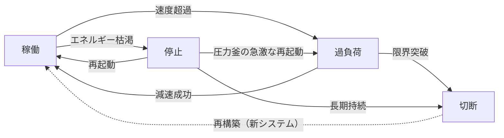
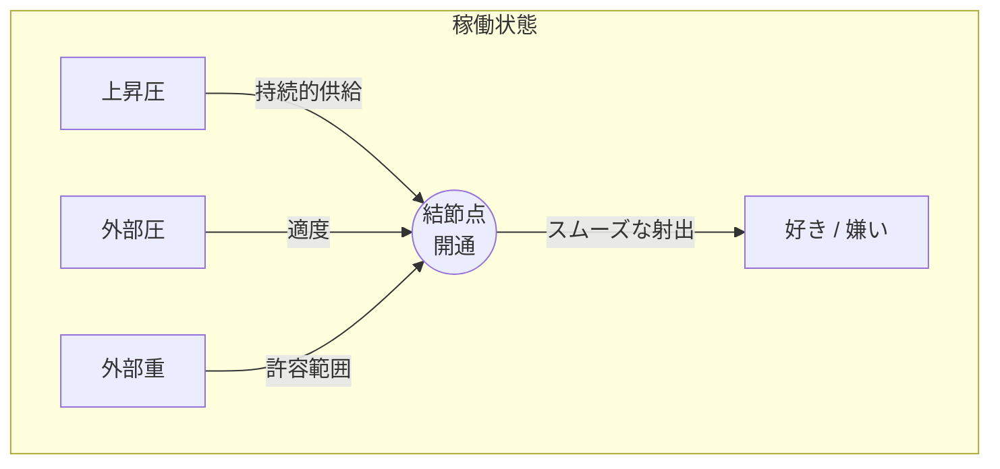
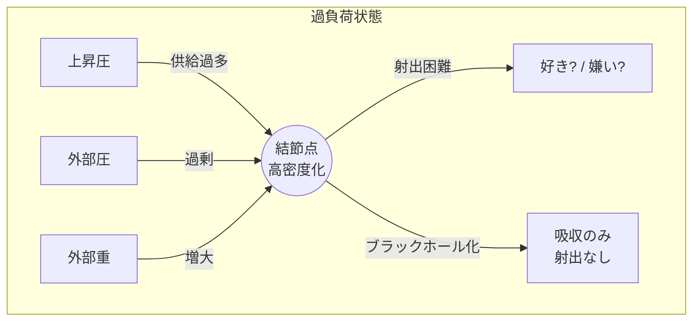
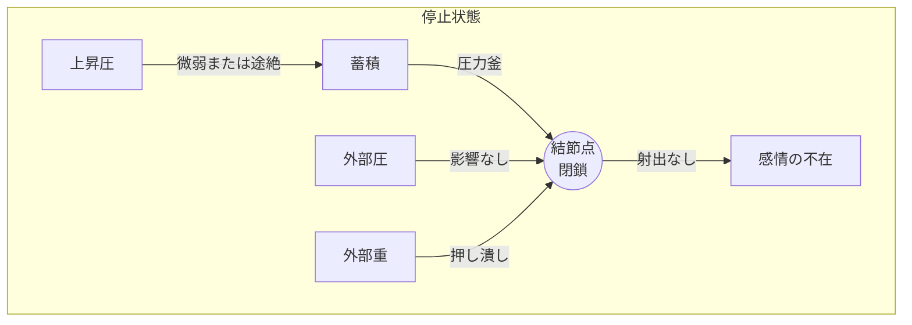
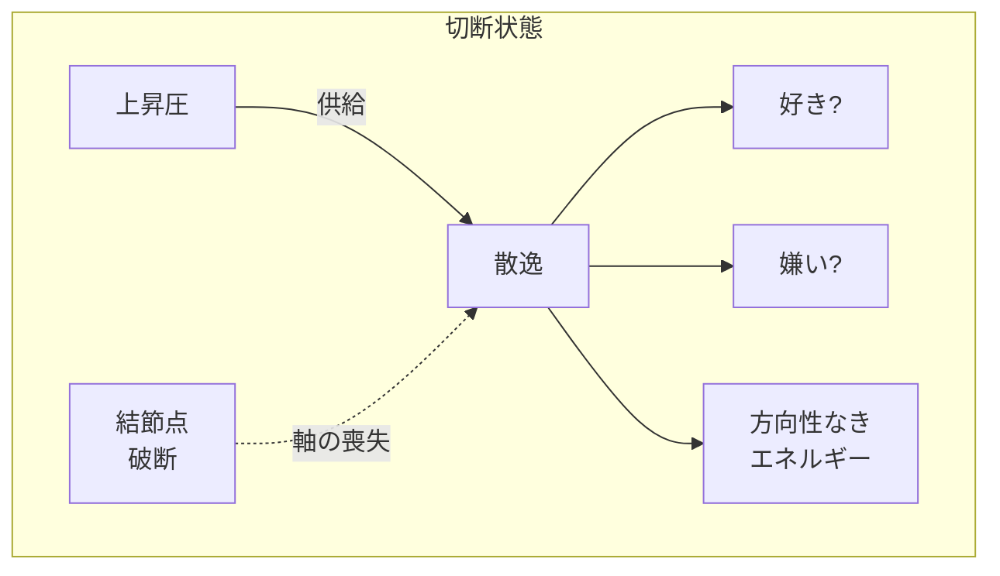

## 第5章　システムの状態定義

ポラリミクスは常に一定の状態にあるわけではない。三つの力のバランス、エネルギーの流量、結節点の状態によって、システムは異なる状態を取る。

本章では、システムが取りうる四つの状態を定義する。

**重要な前提として、このシステムに「リセット」は存在しない。** すべての変化は蓄積され、変質を伴う。過去の状態に完全に戻ることはできない。

|状態|定義|結節点の様相|
|---|---|---|
|稼働|三位が連動し運動している|エネルギーの変換回路として機能|
|過負荷|速度が臨界点に達する|摩擦熱による高密度化、またはブラックホール化|
|停止|運動が完全にゼロになる|エネルギーの蓄積（圧力釜状態）、または仮死|
|切断|ブリッジが破断する|システムの崩壊、統合軸を失ったエネルギーの散逸|

※切断から稼働への点線矢印は、元のシステムの復旧ではなく、新たな結節点による新しいシステムの構築を意味する。

---

### 5-1　稼働

稼働は、システムの正常状態である。

三位一体の計測レイヤーが連動し、三つの力がバランスを保ち、結節点がエネルギーの変換回路として機能している。上昇圧が運んでくるエネルギーは滞りなく変換され、「好き」または「嫌い」として射出される。

稼働状態において、好き嫌いは自然に流れる。

好きなものを好きと感じ、嫌いなものを嫌いと感じる。感情は適切な速度で変化し、極端な固着も極端な振れ幅もない。シーソーは傾き、メトロノームは振れ、回転振り子は回る。

稼働状態を維持するための条件は以下の通りである。

|条件|内容|
|---|---|
|上昇圧の持続|生命衝動が枯渇していない|
|外部圧の適度さ|速度が臨界点を超えていない|
|外部重の許容範囲|摩擦が運動を停止させるほどではない|
|結節点の開通|変換回路が詰まっていない|

稼働は「健全な状態」と言えるが、永続するものではない。力のバランスが崩れれば、システムは別の状態へと移行する。

---

### 5-2　過負荷

過負荷は、システムが限界に近づいている状態である。

主な原因は、速度の臨界点超過である。外部圧が過剰にかかり、感情の切り替えが異常に速くなる。好きと嫌いが激しく振れ、メトロノームが限界速度で往復する。

過負荷状態では、結節点に異変が起きる。

摩擦熱による高密度化が進行する。あるいは、極端な場合には「ブラックホール化」が起こる。ブラックホール化とは、結節点があらゆるエネルギーを吸い込み、射出ができなくなる状態を指す。入ってくるものはあるが、出ていくものがない。

|過負荷の兆候|具体的な現れ|
|---|---|
|感情の激しい振れ|短時間で好き嫌いが反転する|
|判断の困難|好きなのか嫌いなのか分からなくなる|
|消耗感|エネルギーを消費しているのに何も射出されない|
|熱感|内部に摩擦熱が蓄積している感覚|

過負荷からの回復には、外部圧の軽減が必要である。速度を落とし、システムを冷却する。回復に成功すれば稼働状態に戻るが、失敗すれば切断へと至る。

---

### 5-3　停止

停止は、システムの運動が完全にゼロになった状態である。

主な原因は、上昇圧の枯渇である。根源的な生命衝動が弱まり、エネルギーの供給が途絶える。あるいは、外部重が過大になり、摩擦によって運動が完全に止まる。

停止状態では、好き嫌いを感じなくなる。

何を見ても、何を聞いても、何に触れても、「好き」とも「嫌い」とも感じない。シーソーは水平のまま動かず、メトロノームは振れず、回転振り子は静止する。

しかし、停止は「無」ではない。

結節点は閉鎖されているが、消滅してはいない。上昇圧が完全にゼロでない限り、エネルギーは結節点の手前で蓄積され続ける。これを「圧力釜状態」と呼ぶ。

|停止の種類|内容|予後|
|---|---|---|
|圧力釜状態|エネルギーは蓄積されているが射出されない|再起動の可能性あり、ただし爆発リスクも|
|仮死状態|エネルギー供給そのものが極めて微弱|長期化すると切断リスク|

停止からの回復には、上昇圧の回復が必要である。生命衝動が再び湧き上がれば、蓄積されたエネルギーが結節点を押し開き、システムは再起動する。ただし、圧力釜状態からの再起動は、急激な感情の噴出を伴うことがある。この噴出が制御を超えた場合、稼働状態を経ずに直接過負荷へと移行するリスクがある。

---

### 5-4　切断

切断は、システムの最終状態である。

結節点——ブリッジ——が破断する。好きと嫌いを結ぶ軸が失われ、システムは崩壊する。

切断の原因は複数ある。過負荷の限界突破、停止の長期持続、あるいは外部からの致命的な衝撃。いずれの場合も、結節点が耐えられなくなったときに切断は起こる。

切断が起きると、統合軸を失ったエネルギーは散逸する。

好きと嫌いは、もはや対極ではなくなる。極性を失った感情は、方向性なく拡散する。これは「無関心」とは異なる。無関心は稼働状態における低強度の反応である。切断は、反応の軸そのものが失われた状態である。

|状態|好き嫌いの関係|結節点|
|---|---|---|
|稼働|対極として機能|開通|
|過負荷|混濁しつつも対極|高密度化|
|停止|感じられないが対極構造は維持|閉鎖|
|切断|対極構造の崩壊|破断|

切断からの回復は、他の状態からの回復とは質的に異なる。

結節点を「修復」することはできない。一度破断したブリッジは、元には戻らない。可能なのは、新たな結節点を「再構築」することである。それは元のシステムの復旧ではなく、新しいシステムの構築を意味する。

そして、その再構築を可能にするのは、上昇圧——下からの湧き上がり——だけである。

切断が訪れても、上昇圧が絶えない限り、そこには常に新しい「立ち上がり」の予兆が充満している。

---
