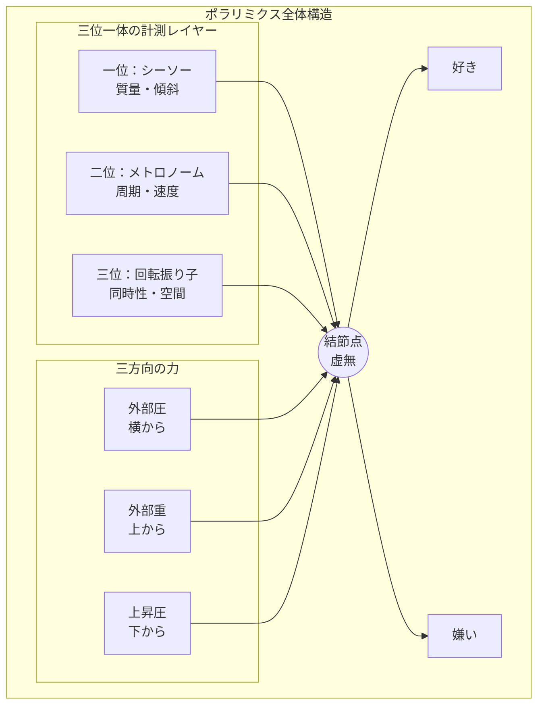

## 第6章　総括

本資料では、「好き」と「嫌い」という現象を、ポラリミクス——好き嫌いの力学——として体系化した。

ここで、全体を振り返る。

---

### 構造の要約

ポラリミクスは、三つの計測レイヤー、三つの力、そして一つの結節点から構成される。

|構成要素|役割|
|---|---|
|三位一体の計測レイヤー|好き嫌いの多面的な性質を計測する|
|三方向の力|システムを駆動し、変容させる|
|虚無的結節点|全てを受け止め、変換し、射出する|

---

### 本質的洞察

ポラリミクスが明らかにしたのは、以下の点である。

**第一に、好き嫌いは状態ではなくプロセスである。**

「好き」という固定された状態があるのではない。シーソーの傾き、メトロノームの振れ、回転振り子の軌道——これらの動的なプロセスの総体として、「好き」や「嫌い」が現れる。

**第二に、好きと嫌いの間には「真ん中」がない。**

中間点としての無関心があるのではない。そこにあるのは虚無的結節点——変換と射出の空虚——である。何もないからこそ、全てを通過させる。

**第三に、好き嫌いは選択ではない。**

私たちは好きになろうとして好きになるのではない。上昇圧が運ぶ名もなきエネルギーが、結節点で符号を与えられ、射出される。私たちはその結果を受け取るだけである。

**第四に、システムはリセットされない。**

すべての変化は蓄積され、変質を伴う。過負荷の痕跡、停止の記憶、切断の傷——これらは消えない。しかし、だからこそ、新しい立ち上がりには意味がある。

---

### 動的平衡の場として

このシステムにおける「好き」と「嫌い」の間にある虚無は、単なる空白ではない。

それは、全圧力を受け止め、速度へと変換し続ける動的平衡の場である。

上昇圧が外部重を突き抜け、結節点が「射出」を続ける限り、このシステムは「私」という存在の極性を生成し続ける。

好きと嫌いは、私たちが世界と関わる仕方である。何かを好きになること、何かを嫌いになること——それは、世界に対して方向性を持つことである。無関心でいられないこと、中立でいられないこと——それは、生きていることの証である。

たとえ停止や切断が訪れても、下からの圧力が絶えない限り、そこには常に新しい「立ち上がり」の予兆が充満している。

結節点は破断しても、上昇圧は湧き続ける。

それが、ポラリミクスの示す希望である。

---
